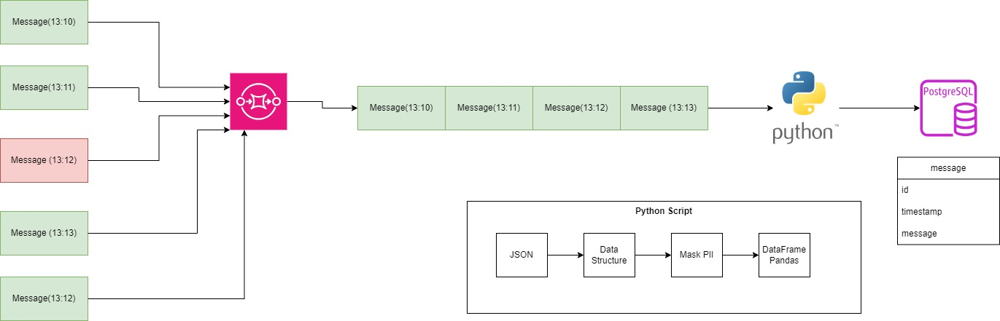

# ETL off to SQS Queue

This README provides a step-by-step guide to setting up a development environment that includes Docker, AWS CLI, LocalStack, and PostgreSQL on Windows Subsystem for Linux (WSL 2), using Python and Visual Studio Code.





## Previous requirements

Make sure you have the following items installed:

- [Visual Studio Code](https://code.visualstudio.com/)
- [Python](https://www.python.org/downloads/)
- [Docker Desktop](https://www.docker.com/products/docker-desktop)
- [AWS CLI](https://aws.amazon.com/cli/)
- [WSL 2](https://docs.microsoft.com/en-us/windows/wsl/install)
- [WSL 2 for Docker](https://docs.docker.com/desktop/install/wsl/)

## Environment Configuration

### 1. Installing AWS CLI on WSL 2

- Open your terminal in WSL 2 (like Bash) to run the commands. You can open WSL 2 from the start menu or by using the wsl command in a PowerShell or CMD window.

- Make sure the packet system on your WSL 2 instance is up to date. Run the following command to do it:

    ```bash
    sudo apt update
    ```

- To install the AWS CLI, run the following command:

    ```bash
    sudo apt install awscli
    ```

- After installation, verify that the AWS CLI is installed correctly by running the following command:

    ```bash
    aws --version
    ```

If you have any questions you can review the [official AWS CLI documentation](https://docs.aws.amazon.com/cli/latest/userguide/install-cliv2-windows.html) to install AWS CLI on your WSL 2 instance.

### 2. Installing LocalStack in WSL 2

- To install LocalStack, run the following command:

    ```bash
    pip install localstack
    ```

- Once you are in the WSL 2 terminal, you can run the following command to start LocalStack:

    ```bash
    localstack start
    ```

- When you're done working with LocalStack, you can stop it by running the following command in your WSL 2 terminal:

    ```bash
    localstack stop
    ```

### 3. Docker Desktop and WSL 2 configuration

- Once you have configured Docker Desktop correctly, you can use Docker on WSL 2 as you would on any other Linux distribution. Open a WSL 2 terminal and run Docker commands.

    To verify that Docker is configured correctly, you can run the following command in your WSL 2 terminal:

    ```bash
    docker --version
    ```

If you have questions about configuring Docker Desktop to use WSL 2, you can review [WSL 2 for Docker](https://docs.docker.com/desktop/install/wsl/).

### 4. Creating a Python Project in Visual Studio Code

Open Visual Studio Code and create a new Python project. Open another terminal and make sure to configure the Python interpreter to use your virtual environment in WSL 2

### 5. Creation of a Virtual Environment

- In the Visual Studio Code terminal, create a virtual environment for your Python project with the following command:

    ```bash
    python -m venv venv
    ```

### 6. Activation of the Virtual Environment

- Activate the virtual environment in the Visual Studio Code terminal with the following command:

    ```bash
    source venv/bin/activate
    ```

- When you want to disable the virtual environment you can use the following command:

    ```bash
    deactivate
    ```

### 7. Installation of Dependencies

Install the necessary dependencies for your Python project in the virtual environment.

For this project it is necessary to install the following dependencies:

- Pandas

```bash
pip install pandas
```

- Boto3

```bash
pip install boto3
```

- SQLAlchemy:

```bash
pip install SQLAlchemy
```

- Cryptography (Fernet is included in this library)

```bash
pip install cryptography
```

### 8. Docker Compose configuration

- Create a [docker-compose.yml](docker-compose.yaml) file in your project to define the Docker services you need, such as PostgreSQL. Configure the connection to PostgreSQL in this file.

- To run a Docker Compose file, you must use the docker-compose command in your system terminal. Make sure you are located in the same folder where the 'docker-compose.yml' file is located. Then, follow these steps:

  - In the WSL2 terminal run the following command to start the files defined in the file:

    ```bash
    docker-compose up
    ```

- Docker Compose will start creating and running containers according to your configuration. You can view the service logs in the terminal to verify that everything is working as expected.

- To stop the services, you can use the following command:

    ```bash
    docker-compose down
    ```

### 10. Application Development

- Here we are only going to execute the code that contains the [DataProcessor.py](DataProcessor.py) class that is configured to read the files from the AWS environment, encrypt the 'device_id' and 'ip' values and subsequently create a dataframe and upload them to Postgres.

- We run the following command to receive a message from the SQS queue called login-queue in the local environment emulated by LocalStack. This is useful for testing and debugging interaction with AWS SQS services.

    ```bash
    awslocal sqs receive-message --queue-url http://localhost:4566/000000000000/login-queue    
    ```

- Once we view the message that is obtained from AWS SQS, run your application in the virtual environment:

    ```bash
    python DataProcessor.py
    ```

- Once the script has been executed and verified that no errors are obtained, we can verify in Postgres if the table with the data we obtained exists, we execute the following commands in the terminal:

    ```bash
    psql -d postgres -U postgres -p 5432 -h localhost -W
    ```

- If we want to see the table in Postgres, let's perform a query:

    ```bash
    select * from user_logins;
    ```

- We have to visualize something similar to the image:

    

